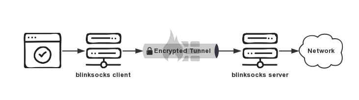

# blinksocks

[](https://www.npmjs.com/package/blinksocks)
[](https://www.npmjs.com/package/blinksocks)
[](https://github.com/blinksocks/blinksocks/blob/master/LICENSE)
[](https://www.npmjs.com/package/blinksocks)
[](https://www.npmjs.com/package/blinksocks)

[](https://travis-ci.org/blinksocks/blinksocks)
[](https://github.com/blinksocks/blinksocks)

A framework for building composable proxy protocol stack.



## Features

* Cross-platform: running on Linux, Windows and macOS.
* Simple proxy interface for Socks5/Socks4/Socks4a and HTTP.
* Transmit over TCP or [TLS](https://github.com/blinksocks/blinksocks/tree/master/docs/config#blinksocks-over-tls).
* Customizable protocols and functional middlewares: using [presets](docs/presets).
* Over **30+** built-in combinations with [benchmark](docs/benchmark).
* Easy and powerful Access Control([ACL](https://github.com/blinksocks/blinksocks/tree/master/docs/presets#access-control)): auto ban, speed limiter.
* Portable/Executable versions available: [download here](https://github.com/blinksocks/blinksocks/releases).
* Compatible with **shadowsocks**(partially). [#27](https://github.com/blinksocks/blinksocks/issues/27)

## GUI ready

For desktop use, you can download official [blinksocks-desktop](https://github.com/blinksocks/blinksocks-desktop),
a cross-platform GUI for blinksocks.

## Getting Started

### Requirements

blinksocks is built on top of [Node.js](https://nodejs.org), if you want to use it in an ordinary way or do some hacking,
please install Node.js(**v6.x and above**) on your operating system.

### Install or Upgrade

You can get the latest blinksocks via package manager **yarn** or **npm**.

> NOTE: Node.js comes with npm installed so you don't have to install npm individually.

**latest stable version**

```
$ npm install -g blinksocks
```

**developing version**

```
$ npm install -g git+https://github.com/blinksocks/blinksocks.git
$ npm install -g git+https://github.com/blinksocks/blinksocks.git#v2.5.5
```

### Without yarn or npm?

If you hate to install and want to get a even more portable version, we have all in one script:

**the latest build(maybe unstable)**

```
$ wget https://raw.githubusercontent.com/blinksocks/blinksocks/master/build/blinksocks.js
```

**previous build(with tag in url, stable)**

```
$ wget https://raw.githubusercontent.com/blinksocks/blinksocks/v2.5.1/build/blinksocks.js
```

## Run blinksocks

**npm version(require Node.js)**

```
$ blinksocks -c blinksocks.client.json
```

**portable version(require Node.js)**

```
$ node blinksocks.js -c blinksocks.client.json
```

**executable version(~~Node.js~~, not GUI)**

```
$ ./blinksocks --help    // Linux and macOS
$ blinksocks.exe --help  // Windows
```

You can [download](https://github.com/blinksocks/blinksocks/releases) precompiled executables for different platforms and launch it directly without having Node.js installed.

> For configuring blinksocks, please refer to [Configuration](docs/config).

## Documents

### For Users

1. [Usage](docs/usage)
2. [Configuration](docs/config)
3. [Presets](docs/presets)

### For Developers

1. [Steps](docs/development/steps)
2. [Principle](docs/development/principle)
3. [Architecture](docs/development/architecture)
4. [Benchmark](docs/benchmark)

## Contributors

See [authors](AUTHORS).

## License

Apache License 2.0