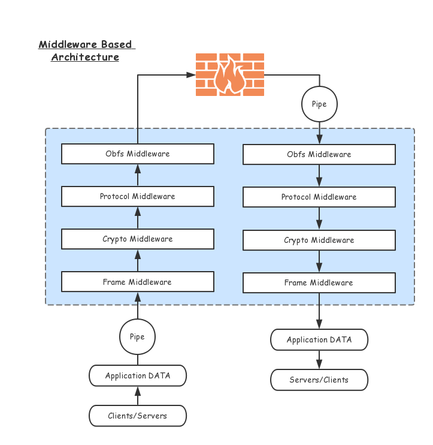

# Architecture

## Socks5

To take over data send and receive of applications, we must find a widely
supported proxy protocol. Socks5 is an ideal one, it only works on the client
side, so don't worry about being attacked.

## HTTP

Blinksocks `v2.1` also support http proxy, you can switch between Socks5 and HTTP smoothly,
without restarting the application.

## Hub, Socket & Relay

### Data Forward (client -> server)

* On the client side

`Hub` gathers connection requests from `Application`, derives `Socket` associate
with each connection. `Socket` first makes handshake with `Application`,
establishes Socks5 connection, then creates a `Relay` associate with itself.

`Relay` retrieves data(payload) from `Application`, packs payload with our
header, encrypts then forwards data to the remote.

* On the server side

`Hub` gathers connection requests from the client, derives `Socket`, 
establishes a TCP connection. `Socket` receives encrypted data from client, 
deliver them to the `Relay`.

`Relay` retrieves data, decrypts, unpacks then forwards data to the real receivers.

### Data Backward (client <- server)

Data backward is simpler than data forward:

* On the server side

`Relay` receives data from the real receivers, ~~packs with our header~~, 
encrypts then backward data to the client.

* On the client side

`Relay` retrieves encrypted data from the server, decrypts, ~~unpacks~~ then 
backwards data to the `Application`.

> NOTE: For TCP relay, backward data(encrypted) does not contain extra header anymore. It's more efficient and secure.

## DNS Cache

Blinksocks use `dns.lookup` which uses operating system facility to resolve 
a hostname to an ip, then cache it in memory for a period of time. Aimed at 
speeding up the transition process.
