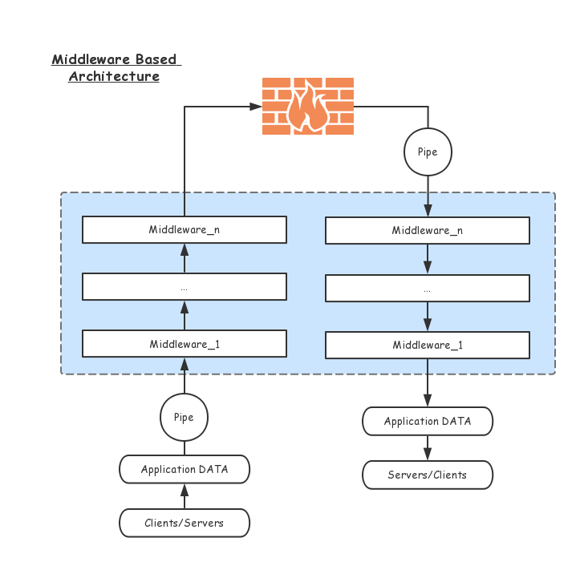

# Architecture



## Proxy Application Data

To take over data send and receive of applications, we must find a widely
used proxy protocol. Http/Socks5/Socks4/Socks4a are ideal, they only work
on the client side, so don't worry about being attacked.

**References**

* [SOCKS4](http://www.openssh.com/txt/socks4.protocol)
* [SOCKS4a](http://www.openssh.com/txt/socks4a.protocol)
* [SOCKS5 RFC-1928](https://tools.ietf.org/rfc/rfc1928.txt)
* [HTTP/1.1 RFC-2616](https://tools.ietf.org/rfc/rfc2616.txt)

## Pipe

Pipe is a duplex facility for dealing with data streaming. A pipe is created once a
connection was open.

Pipe puts all middlewares in cascade(both upstream and downstream), feeds
original data to the first middleware from time to time and gathers processed
data from the last layer of all middlewares.

## Middleware

Middleware is a director which used for processing input data to output data from/to
other middlewares.

Similar to TCP/IP, you can define your own protocol in each layer. Application data are processed
**step by step** from the lowest layer to the top. Middlewares here act as specific layers in the stack.

Here is the original `shadowsocks` protocol implemented in `blinksocks` using the following config:

```json
{
  ...
  "presets": [
    {"name": "ss-base", "params": {}},
    {"name": "ss-stream-cipher", "params": {"method": "aes-256-cfb"}}
  ]
  ...
}
```

These two presets act as two middlewares, processing data from the bottom to the top.

```
+--------+----------------------------------------+
|   IV   |                PAYLOAD                 |
+--------+----------------------------------------+ <-------+
|   16   |                Variable                |         |
+--------+----------------------------------------+         |
                                                            |
                              {"name": "ss-stream-cipher", "params": {"method": "aes-256-cfb"}}
                                                            |
         +------+----------+----------+-----------+         |
         | ATYP | DST.ADDR | DST.PORT |  PAYLOAD  |         |
         +------+----------+----------+-----------+ <-------+
         |  1   | Variable |    2     |  Variable |         |
         +------+----------+----------+-----------+         |
                                                            |
                                            {"name": "ss-base", "params": {}}
                                                            |
                                      +-----------+         |
                                      |   DATA    |         |
              Application Data -----> +-----------+ --------+
                                      |  Variable |
                                      +-----------+
```

Ordinarily, `DST.ADDR` and `DST.PORT` is required to be sent to server(like "ss-base" preset),
otherwise server cannot figure out where to send data to.

The framework will prepend `proxy` preset to the preset list on client side. Action(PROXY_HANDSHAKE_DONE) is fired
once this preset resolved the target address. Other presets(such as "ss-base") who want to use the address should implement
`onNotified(action)` method, the address is stored in `action.payload.targetAddress`.

```js
// core/socket.js
let presets = __PRESETS__;
// prepend "proxy" preset to the top of presets on client side
if (__IS_CLIENT__ && presets[0].name !== 'proxy') {
  presets = [{name: 'proxy'}].concat(presets);
}
// create middlewares and pipe
const middlewares = presets.map((preset) => createMiddleware(preset.name, preset.params || {}));
```

Store target address for further use:

```js
// presets/ss-base.js
import {IPreset} from './defs';

export default class SsBasePreset extends IPreset {

  _atyp = ATYP_V4;

  _host = null; // buffer

  _port = null; // buffer

  onNotified(action) {
    if (__IS_CLIENT__ && action.type === PROXY_HANDSHAKE_DONE) {
      const {type, host, port} = action.payload.targetAddress;
      this._atyp = type;
      this._port = numberToBuffer(port);
      this._host = type === ATYP_DOMAIN ? Buffer.from(host) : ip.toBuffer(host);
    }
  }

  // ...

}
```

## Preset

Preset is the **implementation** of middleware, for examples you can check out [src/presets](../../src/presets),
there are several built-in presets already.

### Custom Preset

A typical preset should extends **IPreset** interface:

```js
// custom.js
import {IPreset} from './defs';

export default class CustomPreset extends IPreset {

  clientOut({buffer/* , next, broadcast, direct, fail */}) {
    // next(buffer); async
    return buffer; // sync
  }

  serverIn({buffer/* , next, broadcast, direct, fail */}) {
    return buffer;
  }

  serverOut({buffer/* , next, broadcast, direct, fail */}) {
    return buffer;
  }

  clientIn({buffer/* , next, broadcast, direct, fail */}) {
    return buffer;
  }

}
```

|  METHODS  |                                   DESCRIPTION                                    |
| :-------- | :------------------------------------------------------------------------------- |
| clientOut | client received data from application, and ready to forward data to server       |
| serverIn  | server received data from client, and ready to forward data to real destination  |
| serverOut | server received data from real destination, and ready to backward data to client |
| clientIn  | client received data from server, and ready to backward data to application      |

> NOTE: `server*` are used on the server side while `client*` are used on the client side.

Every method gets an object which contains three parameters you need:

|           PARAM           |                                                    DESCRIPTION                                                     |
| :------------------------ | :----------------------------------------------------------------------------------------------------------------- |
| buffer                    | output from the previous preset                                                                                    |
| next(buffer, isReverse)   | asynchronously process buffer to the next preset, if isReverse is true, then send data back to the previous preset |
| broadcast(action)         | broadcast an action to other middlewares                                                                           |
| direct(buffer, isReverse) | ignore the following presets, send data directly to fsocket or bsocket                                             |
| fail(message)             | report that the preset is fail to process                                                                          |

### Presets Decoupling

There may be coupling between presets, you can pass an action to broadcast().

Action is a plain object which only requires a `type` field:

```
// action
{
  type: <string>,
  ...
}
```

Once broadcast, **all** other middlewares will receive the action in **onNotified(action)** immediately:

```js
// custom.js
import {IPreset} from './defs';

export default class CustomPreset extends IPreset {

  /**
   * how to deal with the action, return false to ignore
   * @returns {boolean}
   */
  onNotified(/* action */) {
    return false;
  }

  // ...

}
```

NOTE: `onNotified` is **synchronous**.

### Hooks

There are two hooks available:

```js
// custom.js
import {IPreset} from './defs';

export default class CustomPreset extends IPreset {

  beforeOut({buffer/* , next, broadcast, direct, fail */}) {
    return buffer;
  }

  beforeIn({buffer/* , next, broadcast, direct, fail */}) {
    return buffer;
  }

  // ...

}
```

|  METHODS  |         DESCRIPTION         |
| :-------- | :-------------------------- |
| beforeOut | pre-process before `*Out()` |
| beforeIn  | pre-process before `*In()`  |

### Access User Configuration

You can access user configuration from your preset:

```js
import {IPreset} from './defs';

export default class CustomPreset extends IPreset {
  
  constructor() {
    super();
    console.log(__KEY__);
  }
  
}
```

**available constants**

|         NAME         |
| :------------------- |
| \_\_IS_SERVER\_\_    |
| \_\_IS_CLIENT\_\_    |
| \_\_LOCAL_HOST\_\_   |
| \_\_LOCAL_PORT\_\_   |
| \_\_TRANSPORT\_\_    |
| \_\_SERVER_HOST\_\_  |
| \_\_SERVER_PORT\_\_  |
| \_\_SERVERS\_\_      |
| \_\_KEY\_\_          |
| \_\_PRESETS\_\_      |
| \_\_DNS\_\_          |
| \_\_DNS_EXPIRE\_\_   |
| \_\_TRANSPORT\_\_    |
| \_\_TLS_CERT\_\_     |
| \_\_TLS_KEY\_\_      |
| \_\_TIMEOUT\_\_      |
| \_\_REDIRECT\_\_     |
| \_\_LOG_PATH\_\_     |
| \_\_LOG_LEVEL\_\_    |
| \_\_LOG_MAX_DAYS\_\_ |
| \_\_WORKERS\_\_      |
