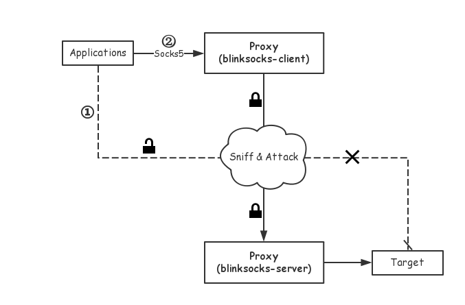

# Principle

## A story

Let's say Tom(`Host`) wants to communicate with Jerry(`Target`). Tom must connect
to the Internet first, then exchanges data through it.

Internet Service Provider(ISP) constructs the Internet, provides us with
Internet connection and services, so we can travel around the world.

Unfortunately, Tom cannot trust anyone(including ISP) on the Internet, because
they often block his connection, sniff, hijack or even steal his data.

Clever Tom and Jerry know how to protect the data which transferred between them.
They both use SSL to encrypt/decrypt the data, and communicate in private.

This is a great idea but still fruitless at the front of the more smart guys.
SSL and other technologies such as PPTP and L2TP themselves are flawed. Bad guys
can easily analyze a packet by its obvious characteristics through the header
or length then block it before the connection between Tom and Jerry is fully constructed.

So Tom have to find another way to deal with the predicament.

## Solution

The shortcomings of SSL is that it can be easily identified because the 
message structure of SSL is public. Attackers cannot grab the plain text
from the encrypted data, but they can block it.

The solution is similar to SSL, but it encrypt all the data(including the header)
transferred on the Internet. All message are just normal data in view of
analyzer, because they are missing valuable information due to fully encryption.

However, fully encryption is not always needed. Data carraies non-encryption and
well-known header can be used for cheating attackers. This approach is called obfuscation.
