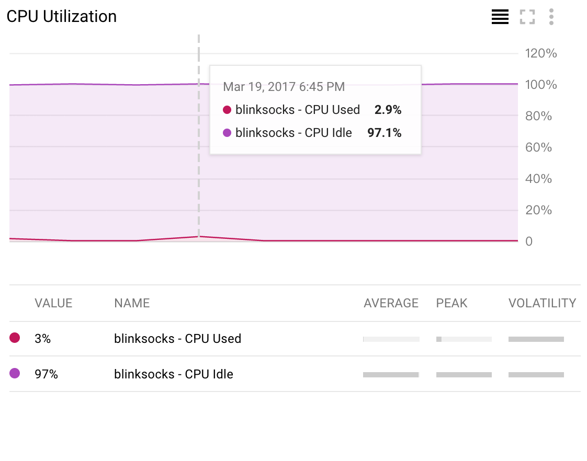
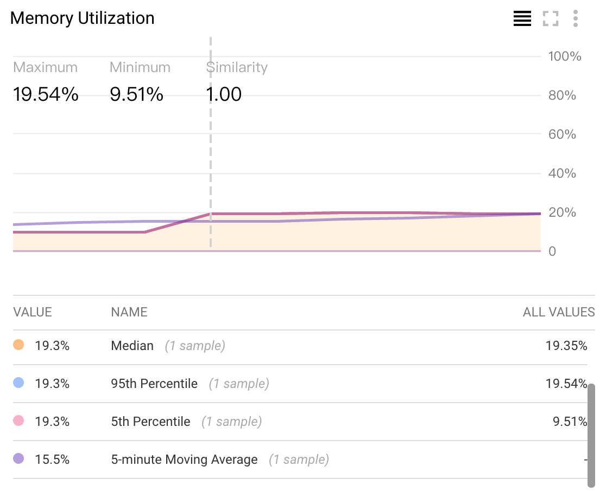
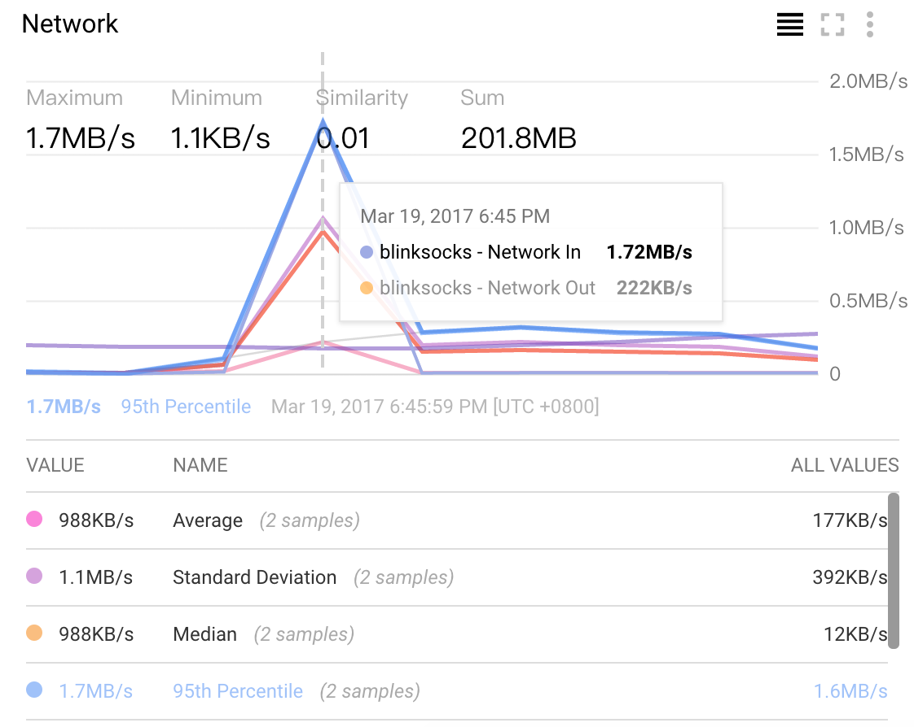
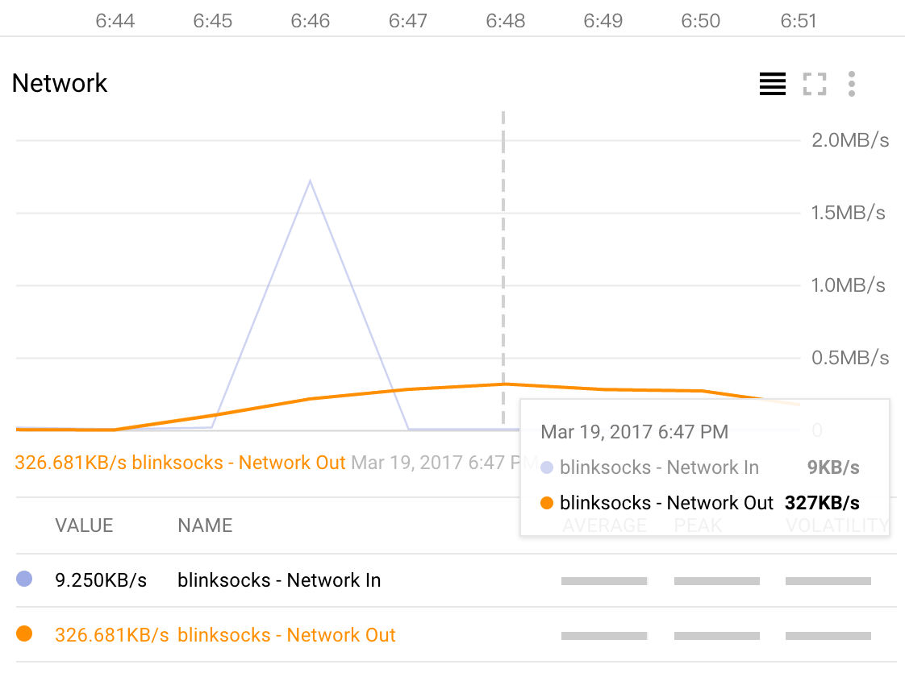

# Performance

Here I prepared a simple report to show the performance of `blinksock` in the real world.

## Test Steps

1. Choose a configuration and deploy blinksocks on both client and server.
2. Prepare a fixed-size file as download target on a third-party server.
3. Free blinksocks server a period of time.
4. Download the target file on client side via `curl --socks5-hostname`.
5. Collect performance data of server from a monitor.

## Configuration

Excluded the `key` field for security.

```json
{
  "host": "0.0.0.0",
  "port": 7777,
  "frame": "origin",
  "frame_params": "",
  "crypto": "",
  "crypto_params": "",
  "protocol": "aead",
  "protocol_params": "aes-256-cbc,sha256",
  "obfs": "",
  "obfs_params": "",
  "log_level": "error"
}
```

## Blinksocks Server Spec

**CPU**: Intel lvy Bridge x1 core

**MEM**: 1.7GB

**BandWidth**: more than 38.9M/s(DL), less than 200KB/s(UL)

NOTE: The Download Speed(DL) was tested via `curl`. The Upload Speed(UL) was tested via `sftp`.

## Target

Target file is served at **Tokyo 2, Japan** of [linode Facilities](https://www.linode.com/speedtest):

File: [100MB-tokyo2.bin](http://speedtest.tokyo2.linode.com/100MB-tokyo2.bin)

Size: **100MB**

## CLIs

* Start service:

```
$ pm2 start blinksocks-run -- -c <config>
```

* On client side:

```
$ curl -L --socks5-hostname <host>:<port> http://speedtest.tokyo2.linode.com/100MB-tokyo2.bin > 100MB-tokyo2.bin
```

## Graphs

Simple duration: `Mar 19, 2017 6:43 PM` - `Mar 19, 2017 6:51 PM`.

Data are collected by [Stackdriver](https://app.google.stackdriver.com).









The ideal situation is the two curve are completely coincide, but the reality is not.

## Summary

* The CPU usage of blinksocks is extremely low(`< 4%`).
* There should be a `memory leak`, because memory haven't been released after download for a long time.
* The network in speed is high(`> 1MB/s`) but out speed is very low(`< 300KB/s`), this probably because
the server bandwidth is not equal on both sides, or blinksocks takes a lot of time(encryption e.g) to send
data out of the server.
