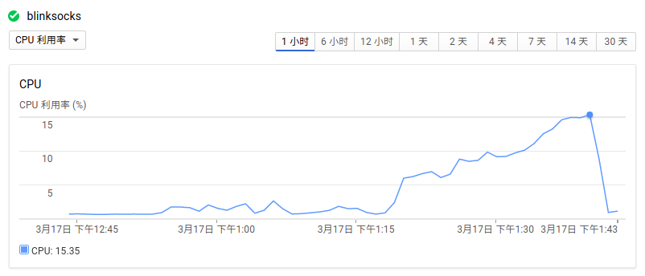

# Performance

Here I prepared a very simple and silly report to show the performance of `blinksock`
in the real world.

More professional reports will be listed here later.

## Download Target

File: [WebStorm-2017.1-RC.tar.gz](https://download-cf.jetbrains.com/webstorm/WebStorm-2017.1-RC.tar.gz)

Size: **251.5 MB**

From **13:18** To: **13:40**

## Configuration

Excluded the `key` field for security.

```json
{
  "host": "0.0.0.0",
  "port": 7777,
  "frame": "origin",
  "frame_params": "",
  "crypto": "",
  "crypto_params": "aes-128-cbc",
  "protocol": "aead",
  "protocol_params": "aes-256-cbc,sha256",
  "obfs": "",
  "obfs_params": "",
  "log_level": "error"
}
```

## CLI

```
$ pm2 start blinksocks-run -i 3 -- -c blinksocks.server.json -q
```

## Server Spec

**CPU**: Intel lvy Bridge x1 core

**MEM**: 1.7GB

**BandWidth**: ?

## Graphs

Data are collected by Google Cloud Platform(GCP) compute engine on server side.

### Network Statistics


### CPU Statistics



## Summary

* The speed and cpu usage are positive.
* The max speed is 404.1KB/s(down) - 382.52KB/s(up).
* The max cpu usage is 15.35%. This is too high I think.
